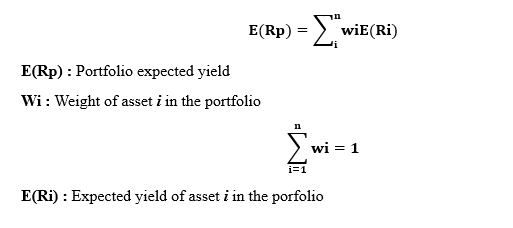
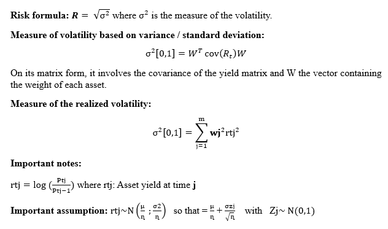

# MarkovitzCritics
In his article titled « The market impact of predictable flows: Evidence from leveraged VIX products » published in 2002, Soren Bundgaard Brogger highlights the VIX (Volatility Index) impacts and its derivatives on investment choices.

This vision is a perennial one because the volatility has been a measure of risk in a lot of investment theories, sometimes coupled with the notion of yield.

In 1952, the American economist Markowitz in its article "Portfolio Selection" presented a model used to produce a said optimal portfolio that maximized the yield while minimizing the risk. This model also emphasizes the importance of diversification through a smooth combination of assets.

Although some of his fellow economists pinpointed several drawbacks to his theory (inefficiency in predicting future yields with past yields, lack of informational efficiency, importance of behavioral bias and investors real aversion to risk, etc), we decided anyway to check Markovitz model:

**1-**	We will compose our portfolio with 2 assets: The first being a 10-year french treasury bonds which is risk-free under the hypothesis that the government can't go bankrupt & the risk is negligible and the second being the stock of the "AIR LIQUIDE" company, a world leader in producing industrial and medical gases. 

**2-**	The Markowitz model uses the variance as a statistical indicator of volatility (since it measures the dispersion around the mean). But what if we use the realized volatility instead? In fact, it has many benefits: it is a more realistic measure of the dispersion, it is an unbiased estimator and ex-post measure of volatility.

**3-**	To measure the yield, we will use its expected value represented by the mean of the possible yields in the period of study (from 1997 to 2022). As a portfolio is sized according to the weights of each asset, its yield is obtained from a weighted average of the assets yield with respect to their size in the portfolio. 

